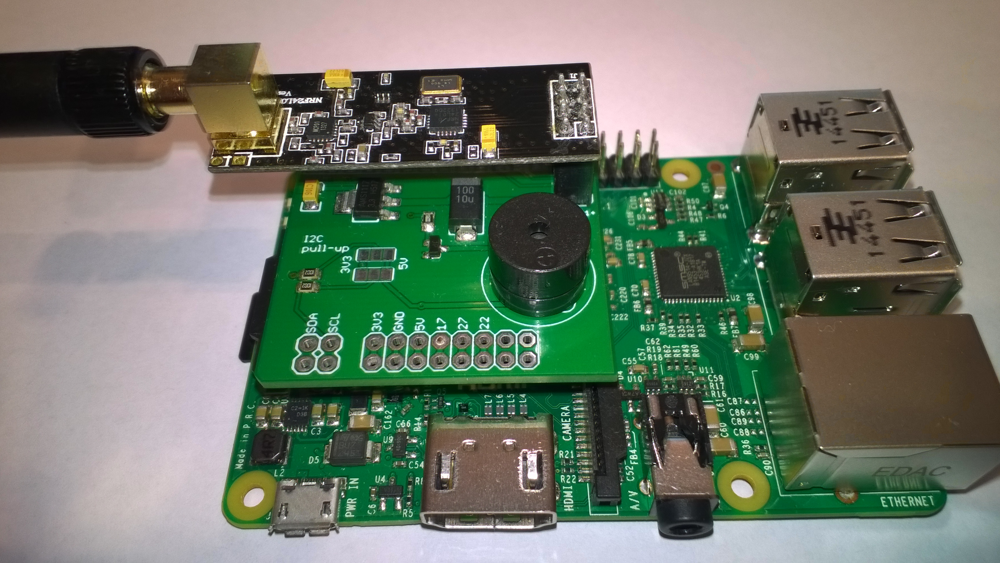
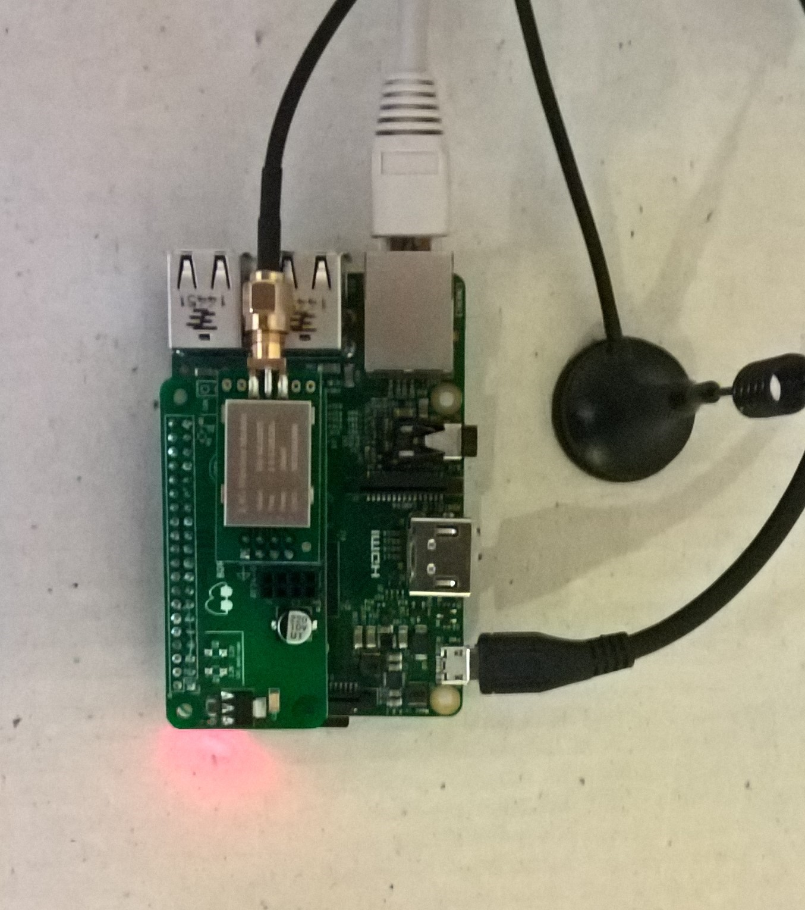
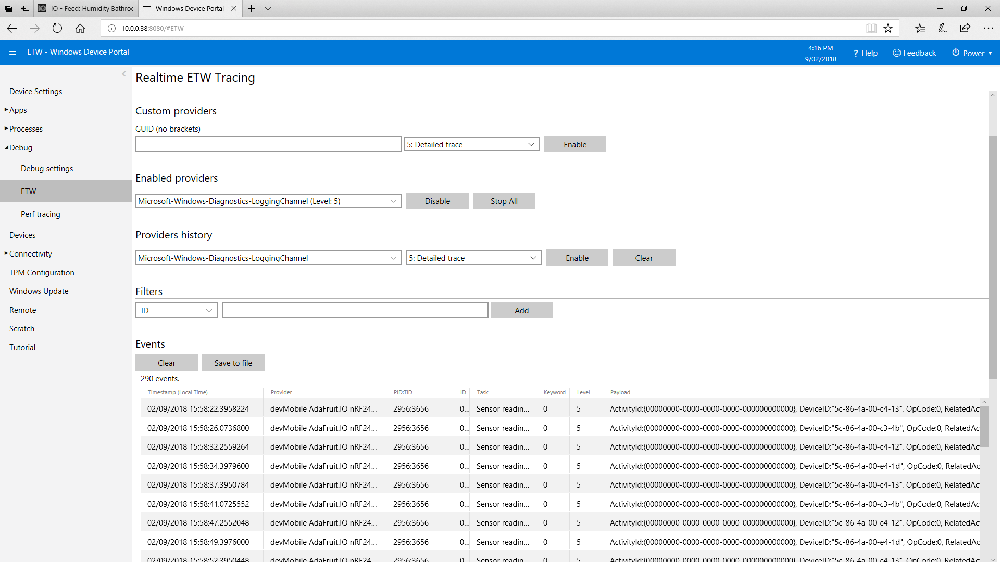
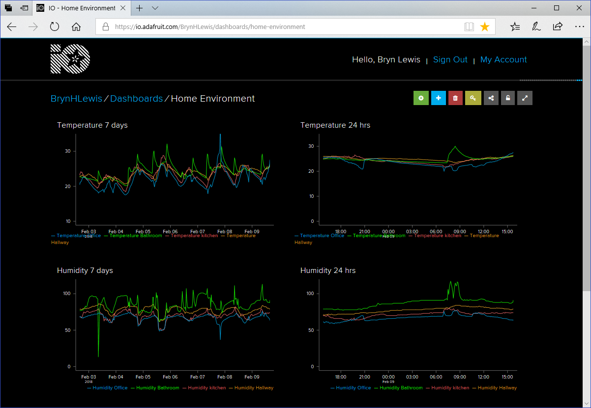

# AdaFruit.IO Windows 10 IoTCore FieldGateway for nRF24L01 devices

A Windows 10 Iot Core based field gateway for uploading telemetry data from [nRF24L01](http://www.nordicsemi.com/eng/Products/2.4GHz-RF/nRF24L01) enabled devices to [AdaFruit.IO](https://io.adafruit.com/)

I use an RPI nRF24L01 shield from [Ceech@Tindie](https://www.tindie.com/products/ceech/new-raspberry-pi-to-nrf24l01-shield) or Dual NRF24L01 pHat/Hat from [BorosLabs@Tindie](https://www.tindie.com/products/boros/borosrf2-dual-nrf24l01-phathat-rtc-for-pis/)

For use with Windows 10 IoT Core the Ceech Hat needs a simple modification detailed in my [blog](https://blog.devmobile.co.nz/2017/07/31/nrf24-windows-10-iot-core-hardware/)

The PI Hat is specified using a confitional compilation symbol defined in the project build properties. The supported options are
* CEECH_NRF24L01P_SHIELD
* BOROS_RF2_SHIELD_RADIO_0 
* BOROS_RF2_SHIELD_RADIO_1

The Boros RF2 shield has two nRF24L01 sockets, in a future release I will add support for both of them being active concurrently.

The Windows 10 IoT Core device logs useful information via Realtime ETW Tracing which can be viewed in the Device Portal Debug\ETW after 
enabling the "Microsoft-Windows-Diagnostics-LoggingChannel" provider.

The gateway has been tested on RP2/3 devices and has run for months without failure. 

Thanks to 
* @techfooninja [RF24](https://github.com/techfooninja/Radios.RF24)
* @abachman (Adafruit.IO swagger docs fixes)
* @RSuter [NSwag](https://github.com/RSuter/NSwag)

The AdaFruit.IO Client was generated using NSwag and the [swagger definition files](https://github.com/adafruit/io-api/blob/gh-pages/v2.json)

I'm have sample Arduino, Seeeduino, Netduino, devDuino client projects and deployment packages under development

AdaFruit.IO API is case sensitive so pay attention to your Feed Key/API endpoints

I use Visual Studio 2017 to deploy the application (it is a background task) to my devices.

There is a sample json configuration file in the root folder. 

The UserName, APIKey & GroupName fields need to be updated then the file uploaded to

User Folders\LocalAppData\ AdaFruitIO.IoTCore.FieldGateway.NRF24L01-uwp_1.0.0.0_arm__nmn3tag1rpsaw\LocalState\

I use the device portal "Apps\File Explorer"

There are more detaiedl instructions and sample projects on Hackster.IO
* nRF24L01 clients (https://www.hackster.io/KiwiBryn)
* Azure IoT Hub project(https://www.hackster.io/KiwiBryn/adafruit-io-nrf24l01-windows-10-iot-core-field-gateway-e4a1e0)
